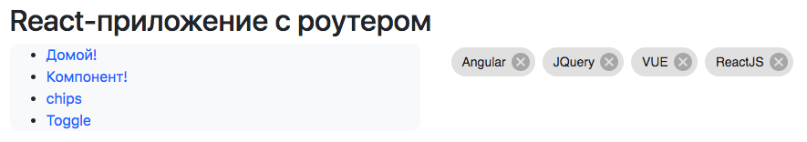

# react_starters1
gentle introduction to react

https://github.com/GossJS/reactDemo2018 - репо к видеоролику по созданию проекта в консоли

ветвь [step2-eslint](../../tree/step2-eslint) содержит подключение линтера (он есть в отдельном репозитории)

https://github.com/GossJS/eslint/tree/flowmin - отдельно о flow

Пример расположения приложения прямо в браузере: https://kodaktor.ru/min_react_live2 

---

по итогам занятия 30.10.2017 создана ветвь [step2-30102017](../../tree/step2-30102017)

где реализован Hot Module Replacement

---
ветвь https://github.com/GossJS/react_starters1/tree/step3-material-router

содержит роутер и MaterialUI

---
по итогам занятия *14.11.2017* создана ветвь 

[step4-heroku-express](../../tree/step4-heroku-express)

 где находится всё готовое для деплоя SPA с клиентским роутером
 
 под управлением express-приложения, перенаправляющего всё на index.html
 
 которая автоматически создаётся вебпаком благодаря HtmlWebpackPlugin
